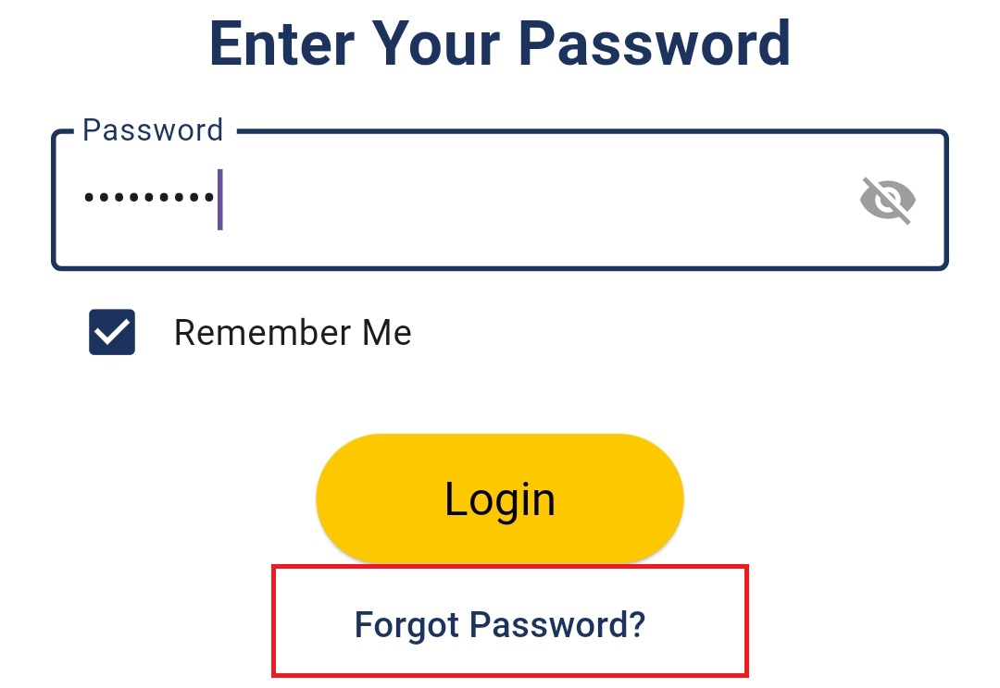

# Admin Log in experience

The **Admin Log In** feature allows verified administrators to securely access their dashboard and manage surveys, students, and analytics in **Survey Center**.\

**1- Enter Admin ID and Password**\
The administrator logs in by entering:

* **Admin ID** — the unique identifier assigned during account creation.
* **Password** — the personal password they set after replacing the default password.\

**2- Remember Me Option**\
On the sign-in screen, there is a **"Remember Me"** checkbox:

* If checked, the app stores the admin's login session locally (using shared preferences).
* This keeps the admin logged in even after closing the app, providing quicker future access without repeated logins.
* The session can be cleared by explicitly logging out or clearing app data.

<figure><figcaption></figcaption></figure>

**3- Forgot Password Functionality**\
If the admin forgets their password, they can tap **"Forgot Password?"**, which triggers a secure password recovery process:

* An email is sent from Firebase to the stored email containing a secure link.
* By clicking the link, the admin is directed to a page where they can set a **new password**.
* Once the new password is set and confirmed, they can return to the app and log in with the updated credentials.

<figure><figcaption></figcaption></figure>

#### **--Security Measures**

* Authentication sessions managed securely via **Firebase Authentication**.
* Password reset links are time-limited and secured by Firebase to prevent misuse.
* "Remember Me" sessions use encrypted local storage to protect credentials.
