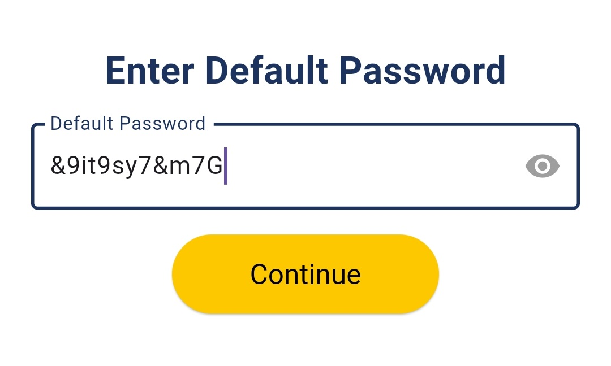
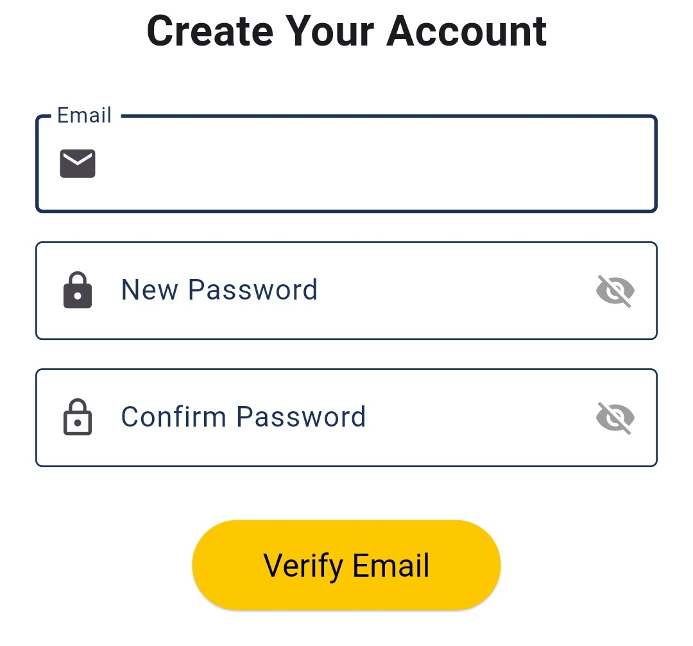
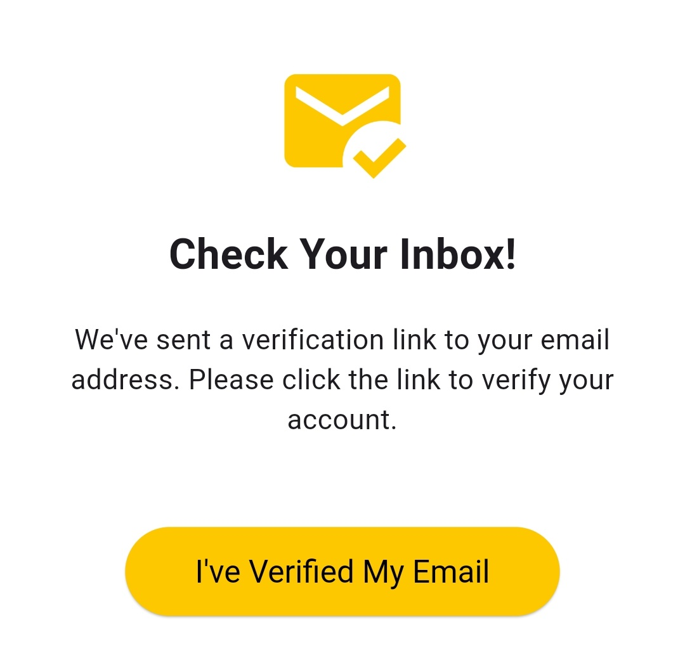

# Admin Sign up experience

The **Admin Sign Up** flow in **Survey Center** is designed to ensure that only authorized faculty members can gain administrator access to the application. This multi-step registration process verifies the identity of the admin and securely establishes their account using **Firebase Authentication**.\

**1- Enter Admin ID**\
The administrator is required to enter their unique **Admin ID**, which is a special identifier assigned and shared directly by the **Super Admin**.

* This ID confirms that the admin has been pre-approved by the faculty leadership to access the system.
* If the ID does not match the list of approved IDs stored in Firestore, the sign-up process cannot proceed.

<figure><figcaption></figcaption></figure>

**2- Enter Default Password**\
After entering the Admin ID, the admin must input the **default password** given by the Super Admin.

* This password acts as an initial verification step to prevent unauthorized access.
* If the default password does not match the credentials linked to the Admin ID, access is denied.

<figure><figcaption></figcaption></figure>

**3- Provide Email Address**\
Once the Admin ID and default password are validated, the admin is prompted to enter their **personal email address**.

* This email will be linked to their account for authentication and password recovery.
* Firebase Authentication will use this email for account verification and password reset features.

**Create New Password**\
The administrator sets a **new password** of their choice, replacing the default password provided earlier.

* The new password must meet security criteria (e.g., minimum length, complexity — depending on app settings).
* This ensures that only the admin knows their updated password moving forward.

<figure><figcaption></figcaption></figure>

**4- Email Verification**\
After setting their password, the system sends a **verification link** to the admin’s provided email address.

* The admin must open the email and click the link to confirm and activate their account.
* This verification step is mandatory to ensure the email is valid and owned by the admin.
* Once the email is verified, the admin’s account is fully activated. They can now log in and start using the admin features of **Survey Center**.

<figure><figcaption></figcaption></figure>

#### **-- Security Measures**&#x20;

* Multi-step identity verification (Admin ID, default password, email).
* Email confirmation ensures valid and active accounts.
* All authentication operations are securely handled via **Firebase Authentication**.
