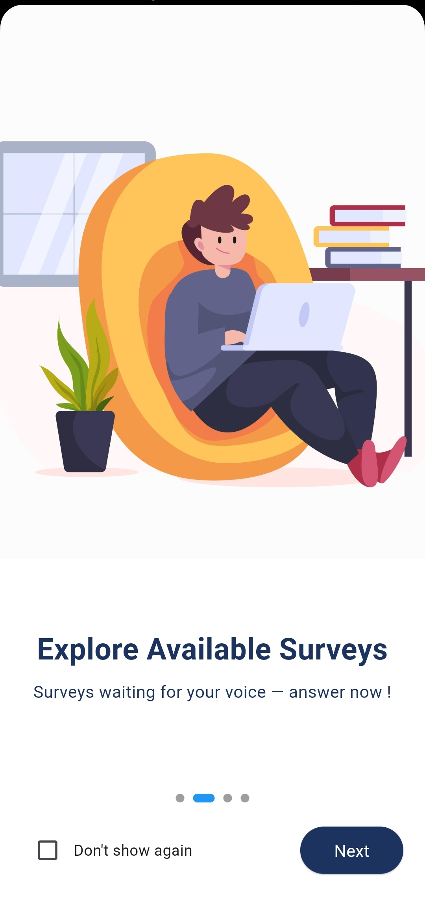

# Splash screen & Welcome screen

The Splash Screen in **Survey Center** serves as the first visual introduction to the app, designed to create a polished and professional first impression

**Key elements:**

* **App Name Display:** The name “Survey Center” fades or slides in alongside the screen to reinforce brand recognition.
* **Smooth Transition:** After the animation completes, the app transitions seamlessly to the Welcome Screen.

<figure><figcaption></figcaption></figure>

The Welcome Screen is the first interactive screen users see after the Splash Screen. It introduces users to **Survey Center** and offers clear navigation options to get started.

**Key elements:**

* **App Logo and Name:**  Consistently displayed to maintain branding.
* **Brief Welcome guide slides :** A short, friendly slides that introduces the purpose of the app and encourages users to continue.
* **“Don’t show again” checkbox** : allows users to skip the welcome slides on future logins for a quicker experience.
* **Navigation Buttons:**
  * **Next button** — for users leading to sign screen (students or admins).

<figure><figcaption></figcaption></figure>
