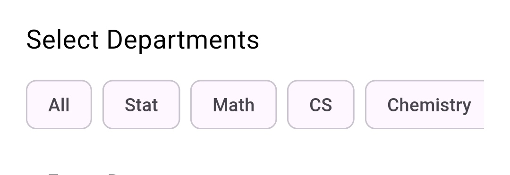
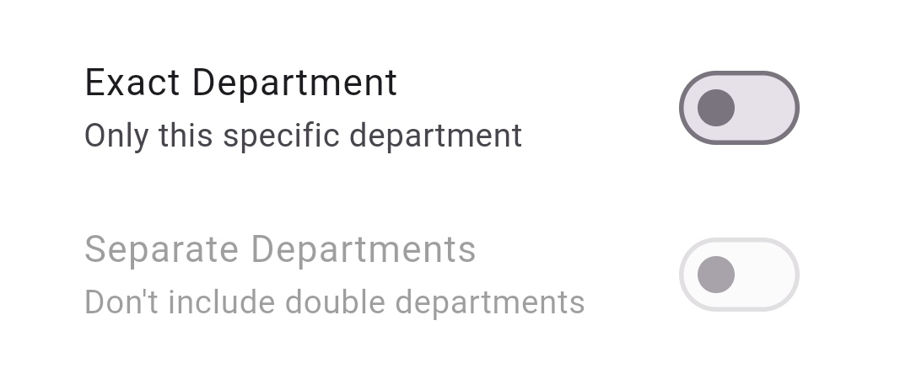

# Create survey screen

The **Create Survey Page** in **Survey Center** empowers admins to design and configure tailored surveys that fit the needs of their departments. The page offers a step-by-step interface to define survey details, target audiences, and build meaningful questions.

#### 1. Choose **Survey Name**

At the top of the page, admins can enter the **title** of the survey.

* **Required Field**: A clear, descriptive name helps students recognize the purpose of the survey.

<figure><figcaption></figcaption></figure>

#### 2. **Select Target Departments**

Admins can specify which departments will have access to answer the survey.

* **Department Selection List**:
  * Select one or multiple departments from the list.
  * Option to **Select All** departments with a single click for broader surveys.

<figure><figcaption></figcaption></figure>

#### 3. **Survey Visibility Options**

After choosing the departments, admins can define how the survey appears to them using two options:

* **Exact Department Only**:
  * Only the **exactly selected departments** will see the survey.
* **Separate Department Access**:
  * Each selected department will see the survey individually, even if they are merged with other departments.

These visibility rules help ensure that surveys reach only the intended student groups.

<figure><figcaption></figcaption></figure>

#### 4. **Set Deadline**

Admins can define an **expiration date** for the survey.

* **Deadline Picker**: Select a specific date after which students will no longer be able to submit responses.
* Helps ensure timely data collection and clear survey duration.

<figure><figcaption></figcaption></figure> <figure><figcaption></figcaption></figure>

#### 5. **Set Response Limit**

Admins can control how many times each student can submit answers to the survey.

* **One-time Response**:
  * Each student can answer the survey **only once**.
  * Prevents duplicate or skewed responses.
* **Multiple Responses Allowed**:
  * Students can submit the survey **more than once** if needed.
  * Useful for surveys requiring periodic feedback.

<figure><figcaption></figcaption></figure>

#### 6. **Add Questions Section**

Admins can build the survey’s questions using flexible options.

* **Choose Question Type** (per question):
  * **Multiple Choice Question (MCQ)**: Students select from predefined answers.
  * **Text Answer**: Students provide an open-ended written response.
* **Flexible Question Builder**:
  * Add as many questions as needed.
  * Easily switch between MCQ or text-based questions.
* **Flexible Question Builder**:

&#x20;      Add as many questions as needed.

&#x20;      Easily switch between MCQ or text-based questions.

<figure><figcaption></figcaption></figure>

*   **For Multiple Choice Questions**:

    * Admins can add multiple answer choices for students to select from.

    <figure><figcaption></figcaption></figure>

#### 7. **Finish Survey Button**

Once all survey details and questions are configured, the admin can tap the **“Finish Survey”** button.

* The survey is saved in the database and made available to the selected departments based on the defined visibility rules.
* The admin is redirected to the **Survey Details** page or the **Home Screen** to view and manage the newly created survey.

<figure><figcaption></figcaption></figure>
