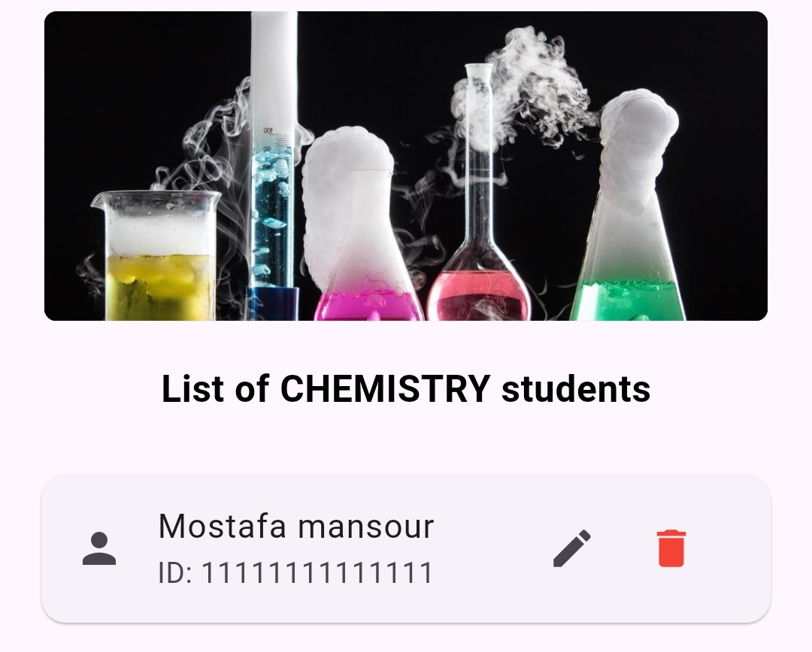

# Group details

The **Group Page** in **Survey Center** provides admins with a detailed view and management tools for all students assigned to a particular department. This ensures that department-specific student data remains accurate and up-to-date for targeted survey distribution.

#### 1. **Student List**&#x20;

The central part of the Department Page displays a **list of all students** assigned to the selected department.

* **Clean Table Layout**: Organized in a simple and readable table format.
* Each row represents one student and includes the following columns:
  * **Student ID**: The unique identifier assigned to the student
  * **Student Name**: The full name of the student
* **Data Retrieval**: The student list is fetched directly from the **Firestore database**, ensuring real-time and up-to-date information.

<figure><figcaption></figcaption></figure>

#### 2. **Manual Edit Option**

Each student row includes an **Edit** button (represented by an edit icon or text).

* When tapped, it allows the admin to manually edit the **ID** and/or **Name** of the student.
* This feature is crucial for correcting mistakes or updating student information without needing to re-upload an entire file.
* **Validation**: Basic input validation ensures that the updated ID and name are properly formatted before saving.

<figure><figcaption></figcaption></figure>

#### 3. **Add Student Manually Button**

At the bottom of the page, there is a clear **“Add Student”** button.

* This allows admins to **manually add a new student** directly into the currently viewed department (without needing to upload a file).
* When tapped, the admin is prompted to enter:
  * **Student ID**
  * **Student Name**
* Upon confirmation, the student is instantly added to the department and the list updates in real time.

<figure><figcaption></figcaption></figure>
