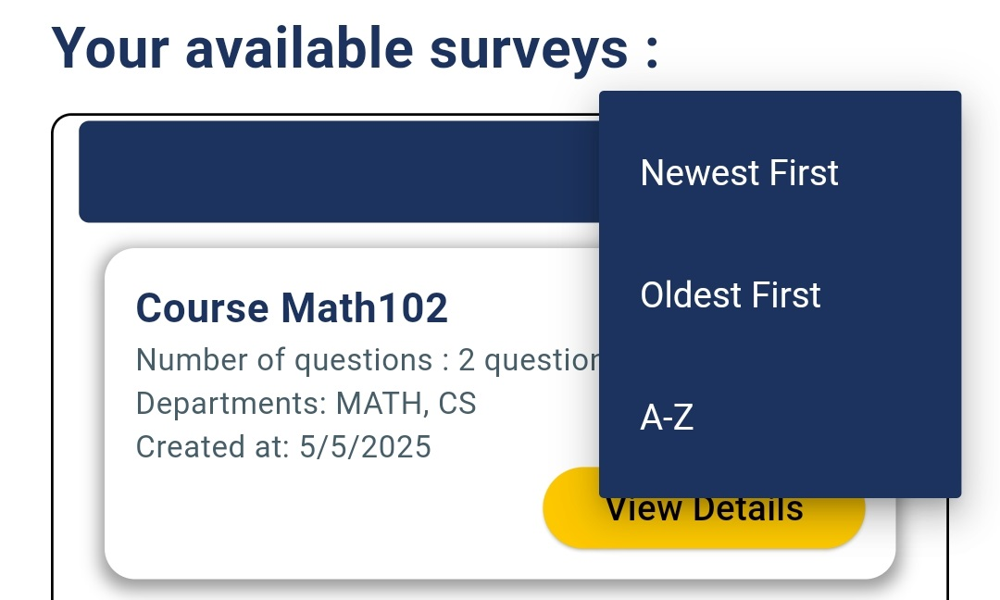
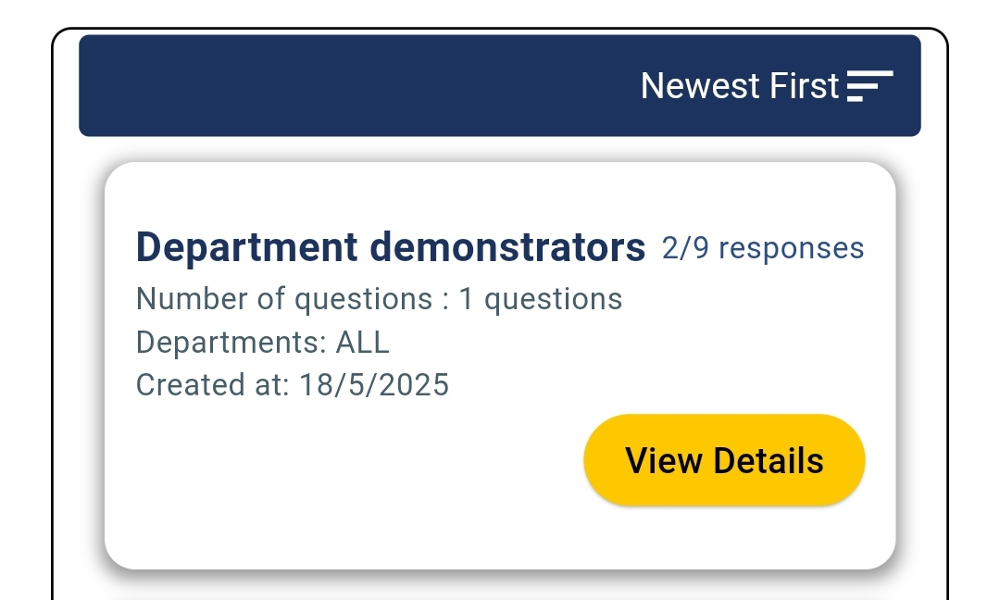

# Home screen

The **Admin Home Screen** in **Survey Center** provides administrators with a clean and organized interface to quickly access, manage, and monitor their surveys. Every element on this screen is designed to help admins efficiently navigate their work and stay focused on their department’s surveys.

#### 1. **Head Bar**&#x20;

At the very top of the screen, the **Head Bar** provides quick access to essential actions.

* **Logout Button**:\
  A clearly visible **Logout** button is available on the left side of the head bar.
  * When tapped, a **confirmation alert** pops up to prevent accidental logouts.

<figure><figcaption></figcaption></figure>

#### 2. **Search Bar**

A prominent search bar sits at the top of the screen to allow admins to quickly locate specific surveys.

* **Real-time Search**: Type the survey name to instantly filter and display matching surveys.
* **Convenient Access**: Saves time by helping admins quickly find what they need without scrolling.

#### &#x20;**Department Filter**

Next to the search bar, a **Filter** option enables admins to narrow down surveys based on departments.

* **Department-Specific View**: Filter surveys to see only those assigned to a particular department.
* **Precise Management**: Helps admins manage surveys efficiently when handling multiple departments.

<figure><figcaption></figcaption></figure>

#### 3. **Welcome Text with Admin Name**

Beneath the search and filter options, a personalized **Welcome Text** greets the admin by name.

* **Dynamic Greeting**: The admin’s name is retrieved from the **Firestore database**, where it’s linked to their Admin ID (assigned by the Super Admin).
* **Example**: _“Welcome, Dr. Amgd talal”_
* Creates a personalized and professional experience for each admin user.

<figure><figcaption></figcaption></figure>

#### 5. **Surveys Box (Main Content Area)**

The central part of the Home Screen displays all the surveys created by the logged-in admin.

* **Private View**: Each admin only sees the surveys they have created — surveys from other admins are not visible.

**a. Sort Bar**

At the top of the surveys box is a **Sort Bar** that allows admins to organize how the surveys are displayed:

* **Newest First**: Show the most recently created surveys at the top.
* **Oldest First**: Show the earliest created surveys first.
* **A-Z Sorting**: Alphabetically sort surveys by name for easy scanning.

<figure><figcaption></figcaption></figure>

**b. Survey Cards**

Each survey is presented in a clean **card** format that displays key information at a glance:

* **Survey Name**: The title of the survey.
* **Number of Questions**: Total questions in the survey.
* **Assigned Departments**: The departments that are allowed to respond to the survey.
* **Date of Creation**: The date when the survey was created.
* **Number of Submissions**: The number of students who have submitted responses and the total number who received this survey .

<figure><figcaption></figcaption></figure>

**c. View Details Button**

Each survey card includes a **“View Details”** button:

* Leads the admin to the **Survey Details Screen**, where they can view more in-depth information, manage the survey, or monitor responses.

<figure><figcaption></figcaption></figure>
