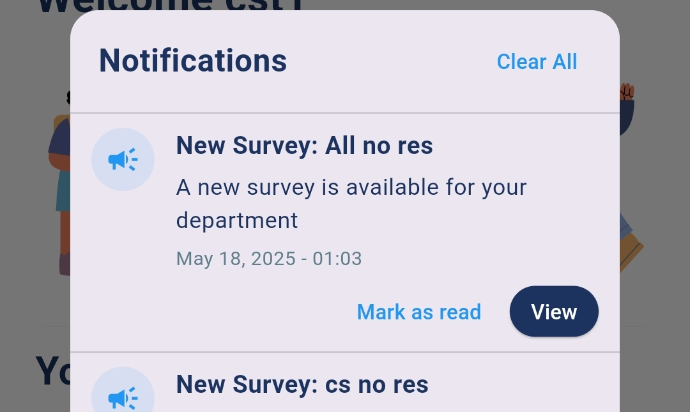

# Home screen

The **Student Home Screen** in **Survey Center** provides students with a simple yet effective interface for engaging with surveys assigned to their department. The home screen focuses on convenience and user experience, featuring **real-time notifications** and a **survey section** tailored specifically to each student’s needs.

#### 1. **Notification Icon in the Head Bar**

* **Real-Time Survey Notifications**: The **notification icon** in the **head bar** alerts students about important updates related to surveys:
  * **New Surveys**: The student will be notified when a new survey has been assigned to their department and is available for participation.
  * **Deadline Reminders**: The notification will also alert the student when the deadline of an active survey is approaching, ensuring they have enough time to complete it before it closes.

<figure><figcaption></figcaption></figure>

* **Interactive Notifications**: Tapping on the notification icon will display a list of notifications, showing:
  * **Survey Name**: The title of the new or upcoming survey.
  * **Deadline**: The remaining time until the survey closes (for deadline reminders).

<figure><figcaption></figcaption></figure>

#### 2. **Surveys Section**

* **Department-Specific Surveys**: The **Surveys Section** on the home screen displays only the surveys that have been assigned to the student’s department, ensuring that irrelevant surveys are not shown.
* **Survey Cards**: Each survey is displayed as a card with key information such as:
  * **Survey Name**: The title of the survey.
  * **Survey Status**: Whether the survey is **active**, **expired**, or **completed**.

<figure><figcaption></figcaption></figure>

**History Section** :  **link to the survey history** allows students to review their past responses, making it easy to track their participation in previous surveys.

<figure><figcaption></figcaption></figure>
