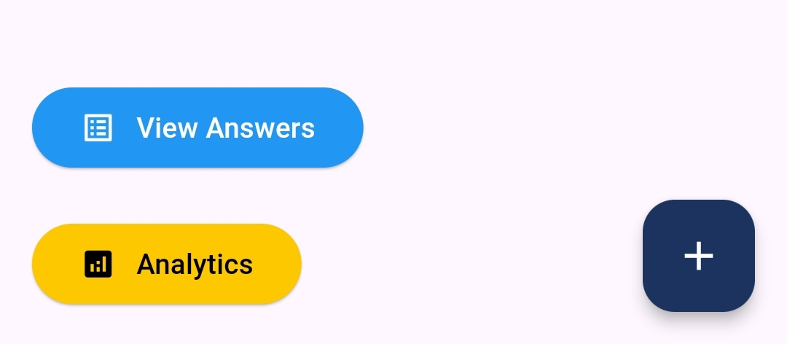

# Survey details

The **Survey Details Screen** in **Survey Center** provides admins with a powerful interface to manage the settings, content, and responses of a specific survey. This screen allows you to download survey responses, make changes to the survey, and access detailed analytics to gain insights from the data collected.

#### 1. Survey Management Options (Settings Menu)

At the top of the page, the **Head Bar** includes a **Settings Icon** on the right side.

* **Download Responses**:
  * This option allows admins to **download all student answers** from the survey as an **Excel sheet**.
  * The downloaded file contains the student ID, student name, and all their survey responses, making it easy for the admin to analyze the data offline.
* **End Survey**:
  * If an admin wants to **stop the survey before its deadline**, they can use this option.
  * Tapping this option will immediately stop any further submissions, and the survey will no longer be accessible to students.
  * A confirmation alert ensures that this action is intentional.
* **Resume Survey**:
  * If the survey was previously ended, the admin can tap **Resume Survey** to restart it.
  * The survey will be re-opened for student responses, as long as the deadline hasn't passed.
* **Delete Survey**:
  * This option allows admins to **delete the survey entirely**.
  * A confirmation alert appears to prevent accidental deletions. Once confirmed, the survey is removed from the system, and all associated data is deleted.

<figure><figcaption></figcaption></figure>

#### 2. **Survey Questions Section**

The main area of the Survey Details Screen displays the questions that have been added to the survey.

* **List of Questions**:
  * The survey questions are displayed in a clear list, showing both the question text and type (Multiple Choice or Text Answer).
* **Edit or Delete Questions**:
  * Each question has an **Edit** and **Delete** button next to it.
  * **Edit** allows admins to modify the question text or answer options (for multiple-choice questions).
  * **Delete** removes the question from the survey entirely.

<figure><figcaption></figcaption></figure>

#### 3. **Floating Action Buttons**&#x20;

At the bottom of the page, there are two **floating action buttons (FABs)** for quick survey management:

* **Add New Question**:
  * Tapping this button opens a modal or form where the admin can add a new question to the survey.
  * The admin will be prompted to choose between:
    * **Multiple Answer**: For questions where students select one or more options.
    * **Text Answer**: For open-ended questions where students provide written responses.
  * After adding the question, it will appear in the list of questions on the Survey Details Screen.

<figure><figcaption></figcaption></figure>

* **Analytics**: This button leads to the **Analytics Page** for this particular survey.
* **View answers :** This button leads to the **Answers Page** for this particular survey.

<figure><figcaption></figcaption></figure>
